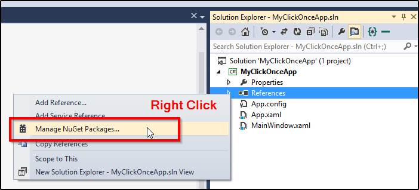
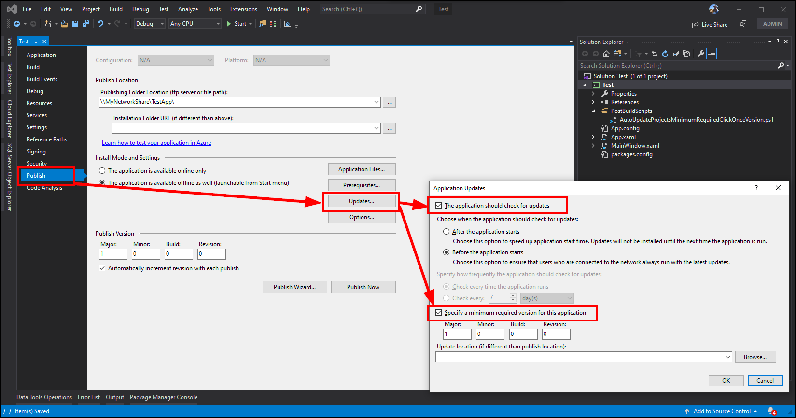

# Project Description

Automatically force the ClickOnce app to update itself without prompting the user; this is less obtrusive to the user experience when receiving updates, and enhances security by ensuring the latest version is used.

This project is [available on NuGet](https://nuget.org/packages/AutoUpdateProjectsMinimumRequiredClickOnceVersion), and is typically intended to be used when publishing your ClickOnce app from Visual Studio.
If you are looking to publish your ClickOnce app from a CI/CD pipeline, check out [this blog post](https://blog.danskingdom.com/continuously-deploy-your-clickonce-application-from-your-build-server/).

## Installation

### .Net Framework Projects

The NuGet package which will handle most of the setup for you.
It adds a post-build event to the project to run a PowerShell script that updates the ClickOnce application's minimum required version in the .csproj file to the latest published version.
This will eliminate the prompt that asks the user if they want to download and install the latest version; instead the update will automatically be downloaded and installed.




As you can see in the last screenshot, it adds a new "PostBuildScripts" folder to your project that contains the PowerShell script that is ran from the project’s post-build event.

### .Net Core Projects

.Net Core projects do not support NuGet packages running scripts during installation, so it cannot automatically add the required post-build event to the project. To do that manually, [see this page](docs/ManuallyConfigureVisualStudioToRunThePowerShellScriptAutomatically.md)

## Setup

After the installation, if you haven't published your ClickOnce app yet, when you build your project it may fail.
If you check the `Output` pane in Visual Studio, it may mention that your project does not have any ClickOnce deployment settings in it.
Before the build will succeed, you need to configure those settings, which can be done by right-clicking the project in Visual Studio and choosing `Publish...` and following the wizard.

In addition to having the publish location defined, you will want to ensure the following settings are also configured.

- In the project properties, on the `Publish` tab, in the `Updates...` button, make sure the following options are checked:
  - The application should check for updates
  - Specify a minimum required version for this application

  

## Troubleshooting

If for some reason the script is not updating your project's MinimumRequiredVersion to the latest published version, check the Visual Studio `Output` window for error messages thrown by the PowerShell script.

## Manually Running The PowerShell Script

Detailed help documentation for manually running the script in PowerShell can be obtained by running the Get-Help cmdlet against the script in a PowerShell window.

For example, open up a Windows PowerShell command prompt, navigate to the folder containing the AutoUpdateProjectsMinimumRequiredClickOnceVersion.ps1 script, and enter:

```powershell
Get-Help .\AutoUpdateProjectsMinimumRequiredClickOnceVersion.ps1 -Detailed
```

## Tips

The first build after each ClickOnce deployment will update the .csproj file, and the project will need to be reloaded.
If you are running an older version of Visual Studio (2012 or earlier), to prevent the reloading of the project from closing any tabs that you have open I recommend installing the [Workspace Reloader Visual Studio extension](http://visualstudiogallery.msdn.microsoft.com/6705affd-ca37-4445-9693-f3d680c92f38).
